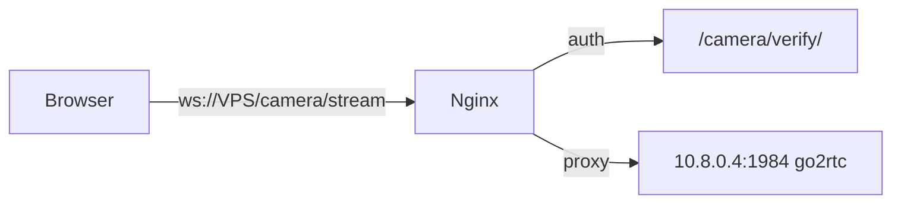

# Toyxona — odamlar sonini kamera orqali kuzatish

Toyxona zallari uchun kamera sync, live stream, ROI va odamlar sonini kuzatish tizimi.

## Modullar

| App | Vazifa |
|-----|--------|
| `apps.main` | Toyxona (Hall), viloyat/tuman |
| `apps.camera` | Kamera sync, snapshot, live stream, ROI |
| `apps.counting` | Odamlar soni dashboard va sync |
| `apps.account` | Foydalanuvchi va ruxsatlar |

## O'rnatish

**Muhim:** alohida PostgreSQL bazasi ishlating.

```sql
CREATE DATABASE toyxona;
```

`.env` da:

```env
DATABASE_NAME=toyxona
SECRET_KEY=...
DEBUG=true
ALLOWED_HOSTS=127.0.0.1
DATABASE_USER=postgres
DATABASE_PASSWORD=...
DATABASE_HOST=localhost
CONTROL_ACCESS_TOKEN=...
CELERY_BROKER_URL=redis://127.0.0.1:6379/10
CAMERA_STREAM_HOST=...
SESSION_COOKIE_AGE=86400
```

```bash
cd toyxona
pip install -r requirements.txt
python manage.py migrate
python manage.py createsuperuser
python manage.py runserver
```

## Ishga tushirish

```bash
python manage.py camera-update
python manage.py sync-people-count
celery -A toyxona worker -l INFO
```

## URL lar

| URL | Sahifa |
|-----|--------|
| `/counting/` | Toyxona tanlash |
| `/counting/<id>/` | Odamlar soni dashboard |
| `/camera/list/` | Kameralar |
| `/camera/preview/<id>/` | Live video |
| `/hall/online/` | Server holati (SSH, SBC, SADP, Snapshot) |

## Live kamera (muhim)

Live video **faqat WebSocket + nginx** orqali ishlaydi (`runserver` yetarli emas).



1. `.env`: `CAMERA_STREAM_HOST=176.101.56.247` (nginx port 80 bo'lsa port yozilmaydi)
2. Nginx: `deploy/nginx-toyxona.conf` ni `/etc/nginx/sites-available/toyxona` ga nusxalang
3. SmartBozor nginx dan tekshirish: `grep -A20 camera/stream /etc/nginx/sites-enabled/*`
4. Gunicorn: `gunicorn toyxona.wsgi -b 127.0.0.1:8000`
5. Admin: har kamerada **username/password** (RTSP) to'ldirilgan bo'lsin
6. `.env`: `CONTROL_ACCESS_TOKEN` haqiqiy token (SmartBozor `.env` dan)
7. Nginx reload: `deploy/nginx-toyxona.conf` (Edge ga `Authorization` header yuboradi)
8. **Live** — preview sahifasi; **ROI** — `?frame=1` edge dan rasm (screenshot bo'lmasa ham)

**ROI rasm yo'q bo'lsa:** ROI sahifasida «Rasmni edge dan yuklash» yoki `python manage.py camera-update --id 1` (snapshots bilan).

Agar stream ishlamasa, SmartBozor serveridagi `proxy_pass` yo'lini `deploy/nginx-toyxona.conf` ga moslashtiring.

## Edge server API

Edge server (`{server_ip}:1984`):

- `GET /api/devices` — kamera ro'yxati
- `GET /api/snapshot/{sn}` — screenshot
- `GET /api/ai/snapshot/{sn}` — AI snapshot
- `GET /api/ai/states` — zona holati (fallback)
- `GET /api/ai/people-count` — `{ "total": 42, "recorded_at": "..." }`
- `POST /api/update-devices` — kamera sozlamalari + ROI + use_ai

## Admin sozlash

1. Viloyat → Tuman → **Toyxona** yarating (`server_ip`, `max_capacity`)
2. Foydalanuvchiga `allowed_hall` bering
3. Server holati uchun `main | Toyxona server holati` ruxsatini bering
4. `camera-update` bilan kameralarni yuklang
5. Kamera login/parol va ROI (sanash zonasi) ni sozlang
6. `use_ai = True` qiling
